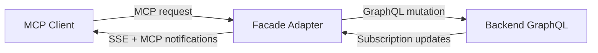

# Architecture

The facade adapter speaks MCP to the client and bridges to a backend GraphQL service.

```mermaid
flowchart LR;
  C[MCP Client] -->|MCP request| F[Facade Adapter];
  F -->|GraphQL mutation| B[Backend GraphQL];
  B -->|Subscription updates| F;
  F -->|SSE + MCP notifications| C;
```

Mermaid source file: `docs/diagrams/architecture.mmd`
